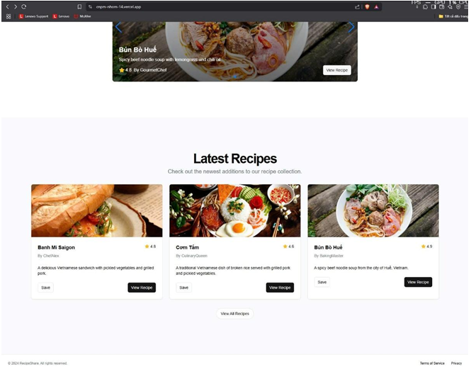

## 🍳 Giới thiệu dự án

Dự án **Website chia sẻ công thức nấu ăn** được phát triển trong khuôn khổ môn **Công nghệ phần mềm**, nhằm xây dựng một nền tảng cộng đồng nơi người dùng có thể **đăng tải, chia sẻ, và khám phá các công thức nấu ăn** một cách dễ dàng.

Hệ thống áp dụng kiến trúc **fullstack hiện đại với BunJS + ElysiaJS (backend)** và **Next.js (frontend)**, tích hợp **Clerk** để xác thực và phân quyền người dùng, đảm bảo trải nghiệm mượt mà, bảo mật và mở rộng linh hoạt.

---

## 🎯 Mục tiêu

- Xây dựng website chia sẻ công thức nấu ăn có khả năng quản lý tài khoản, bài viết và bình luận.  
- Hỗ trợ người dùng tương tác: đánh giá, thích, bình luận, chỉnh sửa bài viết cá nhân.  
- Tạo công cụ quản trị mạnh mẽ cho Admin: quản lý danh mục, nguyên liệu và người dùng.  
- Ứng dụng các quy trình phát triển phần mềm theo chuẩn **Software Engineering (CNPM)**.

---

## ⚙️ Công nghệ sử dụng

| Thành phần | Công nghệ |
|-------------|------------|
| Ngôn ngữ | TypeScript |
| Frontend | Next.js 15 |
| Backend | ElysiaJS (chạy trên Bun) |
| CSDL | PostgreSQL |
| ORM | Drizzle ORM |
| Xác thực | Clerk Authentication |
| Giao diện | TailwindCSS, Shadcn/UI |
| Hosting | Vercel / Railway |
| Dev Tool | Bun Runtime, GitHub Actions |

---

## 👥 Phân quyền hệ thống

| Vai trò | Quyền hạn |
|----------|-----------|
| **Admin** | Quản lý tài khoản, khóa/mở người dùng, CRUD danh mục công thức, nguyên liệu, quản lý bài viết |
| **Người dùng** | Tạo, chỉnh sửa, xóa bài viết; đánh giá bằng số sao; bình luận; thích bài viết; chỉnh sửa hồ sơ cá nhân |

---

## 💡 Các tính năng chính

### 🧑‍🍳 1. Quản lý tài khoản & phân quyền (Clerk)
- Đăng ký / đăng nhập an toàn qua **Clerk**.  
- Phân quyền rõ ràng giữa **Admin** và **Người dùng**.  
- Quản lý phiên đăng nhập, cập nhật hồ sơ, ảnh đại diện.

### 📚 2. CRUD bài viết công thức nấu ăn
- Người dùng có thể **thêm, sửa, xóa** công thức nấu ăn.  
- Gắn thẻ danh mục và nguyên liệu cho từng công thức.  
- Xem chi tiết công thức (ảnh, mô tả, nguyên liệu, cách làm).

### 🌟 3. Đánh giá & bình luận
- Mỗi công thức có thể được đánh giá bằng **hệ thống sao (1–5)**.  
- Người dùng có thể để lại bình luận hoặc phản hồi.  
- Hệ thống hiển thị **tổng điểm trung bình và số lượt đánh giá**.

### ❤️ 4. Tương tác & hồ sơ người dùng
- Tính năng “**thích**” công thức yêu thích.  
- Quản lý **profile cá nhân**: thông tin, avatar, danh sách công thức của mình.  
- Lưu công thức đã thích hoặc đã xem.

### 🧑‍💼 5. Bảng điều khiển Admin
- Quản lý danh sách người dùng (kích hoạt / vô hiệu hóa).  
- CRUD danh mục công thức & nguyên liệu.  
- Duyệt và xóa bài viết vi phạm.  
- Thống kê tổng số bài đăng, người dùng, và lượt tương tác.

---